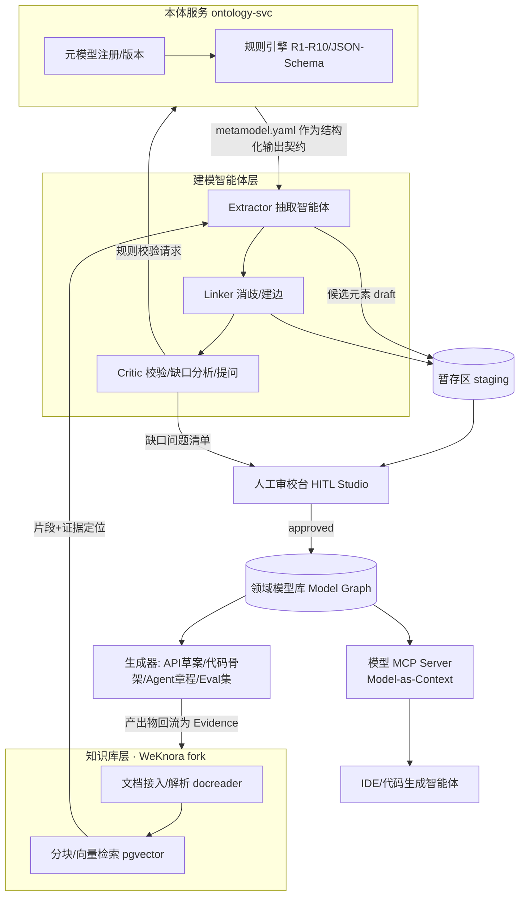

# 方案架构 v0.1 —— 本体驱动的领域建模与智能化改造平台

> 前置阅读：`docs/ontology-spec.md`。本文档回答：系统由什么组成、数据怎么流、
> 关键决策是什么、如何验证。

## 1. 目标与非目标

**目标**
- G1 存量改造：业务/技术文档 + 接口/代码扫描 → 逆向生成**可溯源的领域模型**（本体约束）
- G2 新建开发：需求文档 → 正向建模 → 生成契约/骨架/Agent 章程/评测集
- G3 模型即上下文：领域模型以 **MCP** 暴露给 IDE/开发智能体，约束其生成行为
- G4 全链路溯源：每个模型元素都能回答"依据是什么"（Evidence）

**非目标（v0.x 不做）**
- 不做全自动建模（智能体只产出 proposed，批准权在人）
- 不做通用图数据库/通用本体编辑器（只服务 UDOM 元模型）
- 不替代运行时的智能体平台（我们是"设计态+治理态"平台）

## 2. 总体架构



**两条生产线**
- **逆向线（存量）**：存量文档/接口扫描 → 抽取 → 逆向领域模型 → 缺口分析
  （哪些 BusinessRule 无执行点 R4、哪些系统未被 MCP 包装）→ 智能化机会标注
- **正向线（新建）**：需求文档 → 动机层建模（Vision→Objective）→ 领域层 →
  智能体层装配 → 生成骨架与契约 → 上线后运行证据回流


## 3. 组件职责与关键决策

### C1 知识库层 = WeKnora（已核实：MIT / Go+Vue / Postgres+pgvector / 自带 mcp-server 模块）
- **fork 策略：浅 fork + 外挂扩展**。我们的新组件（本体服务、建模智能体、模型库、审校台）
  全部作为独立服务与 WeKnora 通过其 REST API（约 360 个端点）对接，**不改 WeKnora 内核**，
  保持可跟随上游升级。WeKnora 以 git submodule 方式 vendor 在本仓库 `third_party/WeKnora`。
- 复用：文档解析（docreader）、分块与混合检索、多租户知识库、既有 MCP 能力。

### C2 本体服务 ontology-svc（新建，Python/FastAPI）
- 职责：元模型注册与版本管理；实例校验（复用 `tools/validator` 内核）；规则引擎；
  向抽取智能体分发"当前生效的 metamodel 版本 + JSON Schema"。
- **决策 D1：本体载体 = YAML 元模型 + 规则引擎（v0.1），OWL/SHACL 导出放 v0.2**。
  理由：YAML 对工程团队可读可改、直接可作为 LLM 结构化输出契约；OWL 推理在
  当前规则集（R1-R10 多为存在性/基数约束）上收益有限，待需要类层次推理时再升级。

### C3 建模智能体群（新建，编排于 WeKnora Agent 模式或独立运行时）
| 角色 | 职责 | 关键设计 |
|---|---|---|
| Extractor | 文档片段 → 候选元素+证据 | metamodel 即输出 Schema；**强制 Evidence 引用**（无证据不出元素）；`clues` 线索词辅助召回 |
| Linker | 跨文档消歧、合并、建边 | 术语对齐查 R8；同义合并需人工确认 |
| Critic | 调用规则引擎、缺口分析、生成给人类的提问清单 | 输出"问题"而非"答案"（例：这个 Agent 定 L2，但找不到 hitl 护栏，请确认） |

### C4 领域模型库（新建）
- **决策 D2：起步用 PostgreSQL（elements JSONB + relations 表），与 WeKnora 同栈**；
  当需要多跳影响分析/图算法时再引入 Neo4j（接口层抽象，存储可替换）。
- 模型即数据：每次提交是一个 model 版本（git 式 staging/commit 语义）。

### C5 人工审校台 HITL Studio（Vue 扩展模块）
- 评审队列（按置信度升序）、元素/关系 diff、图谱画布、批准流、Critic 问题清单答复入口。

### C6 模型 MCP Server（新建）——"本体约束开发"的出口
- 工具示例：`get_bounded_context(name)`、`get_glossary(ctx)`、`validate_element(draft)`、
  `impact_analysis(element_id)`、`get_agent_charter(agent)`。
- 消费方：IDE 编程智能体（生成代码前查模型、提交前过校验）、生成器、运行期智能体的治理查询。

## 4. 关键数据流（逆向线）

```
文档入库 → docreader 解析 → 分块(带位置坐标)
  → Extractor(metamodel约束, 结构化输出+证据坐标) → 候选元素(draft, confidence)
  → Linker(消歧/建边) → staging
  → Critic(规则R1-R10 + 缺口提问)
  → 人工审校(批准/修改/驳回) → commit 到模型主干
  → MCP 暴露 + 生成器消费 → 产出物(代码/契约/章程) 回流为新的 Evidence
```

## 5. 验证方案（M6，但从 M3 开始采集数据）

| 指标 | 定义 | 目标（首版） |
|---|---|---|
| 元素 P/R | 抽取元素相对人工标注黄金集的精确率/召回率 | P≥85% / R≥70% |
| 边正确率 | Linker 建边经人工确认的比例 | ≥80% |
| 规则符合率 | approved 模型通过 R1-R10 error 级规则 | 100% |
| 人工修改率 | 评审中被修改/驳回的元素占比（越低越好） | ≤30% |
| 建模提效 | 同等文档人工建模 vs 本系统建模的工时比 | ≥3× |
| 溯源完整率 | 带 ≥1 Evidence 的元素占比（R6） | ≥95% |

**验证语料**：选 1 个真实存量系统（3-5 份业务文档 + 接口文档）+ 1 个新建需求 PRD；
先人工建黄金模型（2 人背对背 + 仲裁），再跑系统对比。

## 6. 风险与对策

| 风险 | 对策 |
|---|---|
| LLM 抽取幻觉（编造元素） | 无证据不出元素（硬性）+ Critic 复核 + 置信度门槛 |
| 本体过早膨胀 | 每个新类型须声明消费者；v0.1 冻结评审后再扩展 |
| WeKnora 上游大改 | 浅 fork 策略；对接面收敛到 REST API |
| 业务方不认"模型" | 审校台用业务语言渲染（动机层先行，图谱后置） |

## 7. 构建路线（M1-M6）

- **M1 ✅ 本体 + 校验器 + 示例（本次交付）**
- M2：vendor WeKnora、compose 跑通；ontology-svc 骨架（注册/校验 API）
- M3：Extractor PoC（单文档→候选元素，带证据坐标）；用示例金标准自测
- M4：模型库 staging/commit + Critic + 审校台 MVP
- M5：模型 MCP Server + 一个生成器（Agent 章程生成）打通闭环
- M6：真实语料端到端验证，产出指标报告
